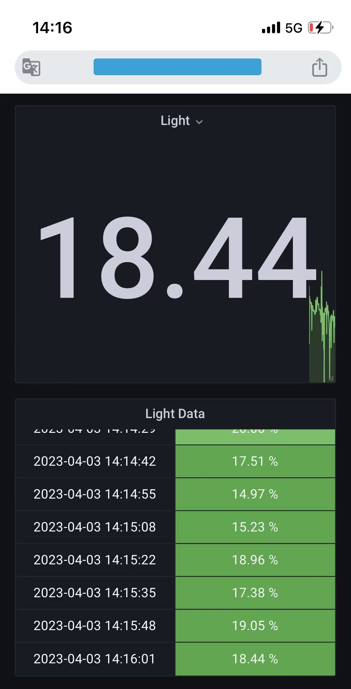

# IOT_Environment_Detection ESP32桌上环境监测
实用好看，基于ESP32，实现桌上温湿度、气压、环境光监测，本地交互，并把信息发送到云端。

## 项目简介

基于ESP32，实现桌上温湿度、气压、环境光监测，并把信息发送到云端。

这个项目被称为文物修复项目，它来源于两年前一晚上折腾出来的实验课大作业。因为其美丽的透明洞洞板以及没有使用一根杜邦线乱飞的设计，被我认为是当时最好的非PCB制版作品 ~~，也曾作为我和前男友的定情信物~~ 。不幸的是，它在毕业搬家途中损坏，OLED屏碎裂，ESP8266的CH340芯片失效。

项目的目标是让这个小板子复现往日荣光，并且能够作为桌面摆件长期存在。

Todo:

- [x] OLED 屏保动画
- [x] OLED 数据显示
- [ ] ~~BMP280 通信读取温湿度~~
- [x] TEMP6000 的光照
- [x] 数据传到服务器中，实时监测且后台监控
- [x] 电池以及电池充电
- [ ] 代码整理：好的代码规范源于调试完之后再归档（x
- [ ] 服务器上的数据分析：基于环境光模块的实验室卷王检测

## 1. OLED 显示
使用太空人动画，取模的操作之前已经做过里，直接将spaceman.h拿过来用。
数据显示包含WiFi连接状态、从网络获取的时间（23-03-30）(21:35:20)、环境光(%)

## ~~2. BMP280 读取温湿度~~

~~由于IIC管脚限制，我试图使用软件模拟IIC的方式来进行BMP280的通信……~~
在测试中，发现BMP280模块损坏。

## 3. TEMP6000 的环境光
简单的ADC读取，但是这模块读出的环境光似乎是一个周期信号。对输出信号添加了一个均值滤波器。由于现在室内比较暗，所以对光强加一个对数，并采用小学三年级的时候学过的A律13折线的方法轻量化实现，这样数据会比较好看。

## 4. 数据后台监控
之前搭好的仍然是InfluxDB + Grafana，效果如图：

## 5. 代码结构改进
让依托答辩的代码具有可读性，施工中……

## 其他的
新旧对比图

检测到师兄上班时间为北京时间九点二十七。